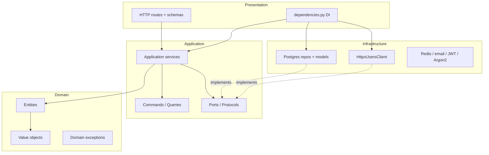
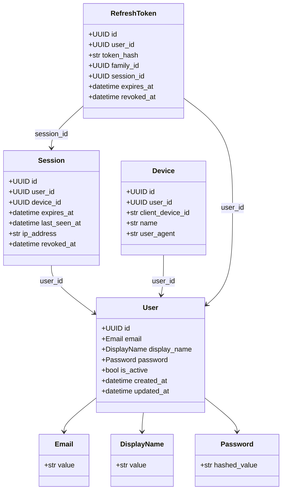
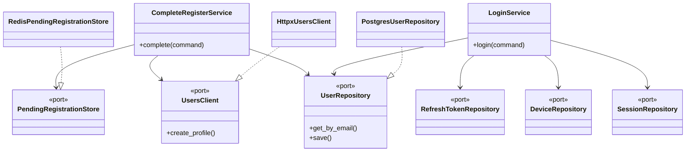
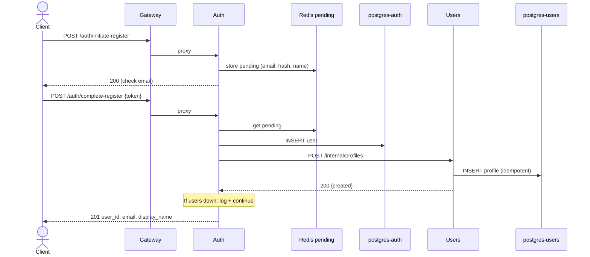

# Auth service — UML diagrams

Mermaid diagrams for `app/auth/`. Render in GitHub, VS Code Mermaid preview, or [mermaid.live](https://mermaid.live).

## Clean Architecture layers



## Domain class diagram



## Ports and adapters



## Sequence — register (auth → users)



## HTTP surface (via gateway `/auth/*`)

| Method | Path |
|---|---|
| POST | `/auth/initiate-register` |
| POST | `/auth/complete-register` |
| POST | `/auth/login` |
| POST | `/auth/logout` |
| POST | `/auth/refresh` |
| POST | `/auth/forgot-password` |
| POST | `/auth/reset-password` |
| POST | `/auth/change-password` |
| GET | `/auth/devices` |
| GET | `/auth/sessions` |
| DELETE | `/auth/sessions/{session_id}` |

## Cross-service

```text
auth ──POST /internal/profiles──► users
```

Compose-only; not exposed on the gateway.
