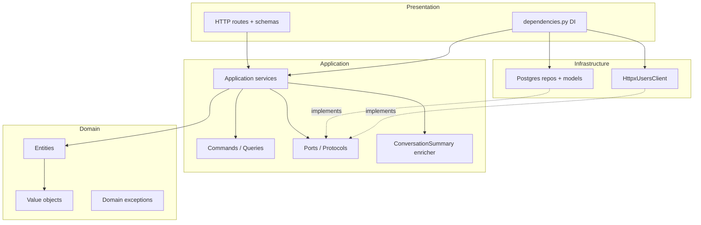
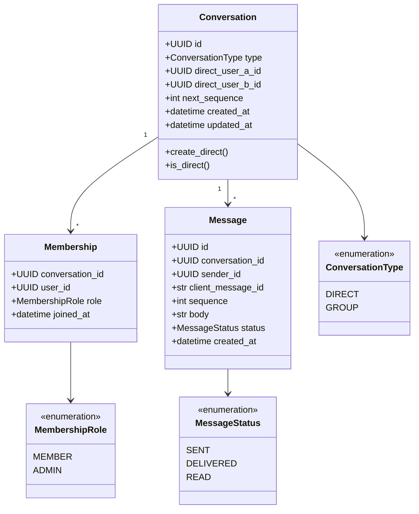
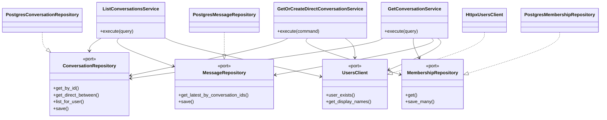
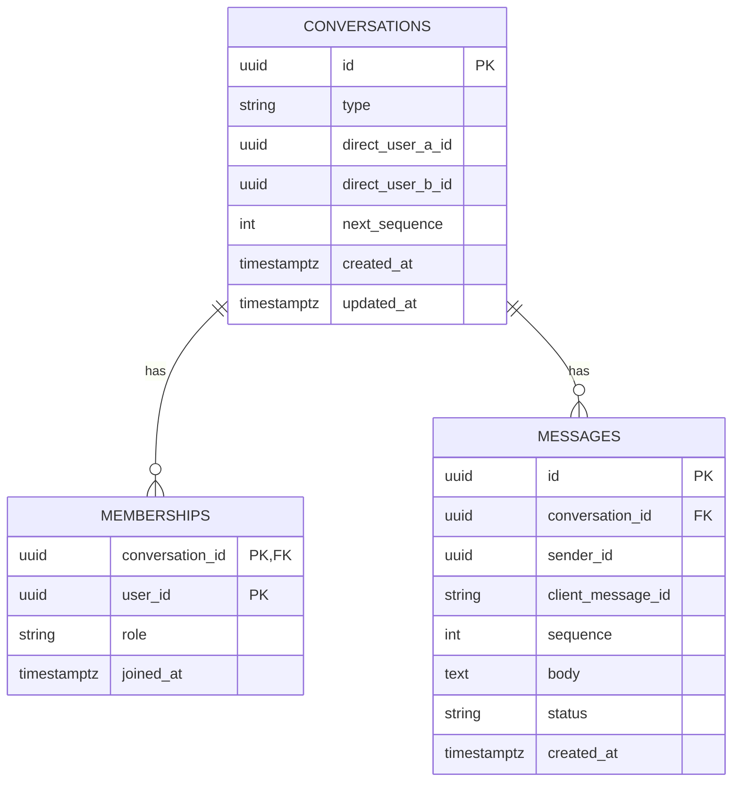
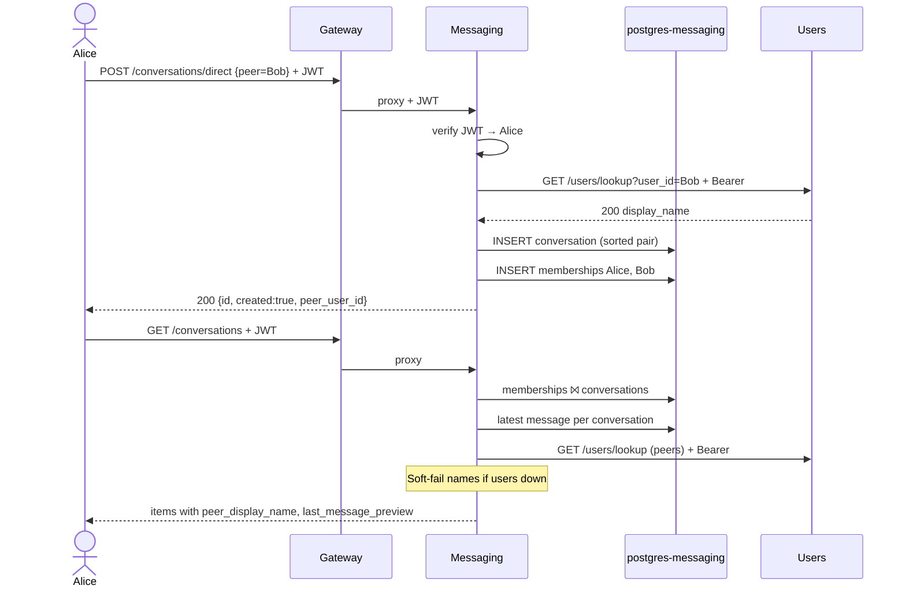
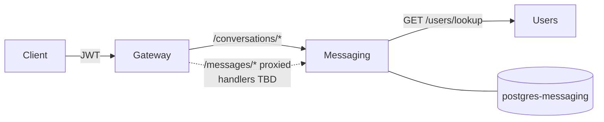

# Messaging service — UML diagrams

Mermaid diagrams for `app/messaging/`. Render in GitHub, VS Code Mermaid preview, or [mermaid.live](https://mermaid.live).

## Clean Architecture layers



## Domain class diagram



## Ports and adapters



## ER diagram (Postgres)



## Sequence — start 1:1 chat + list



## System context (messaging neighborhood)



## HTTP surface (via gateway)

| Method | Path |
|---|---|
| GET | `/health` |
| POST | `/conversations/direct` |
| GET | `/conversations` |
| GET | `/conversations/{conversation_id}` |

Send/list message routes are not implemented yet; gateway still proxies `/messages/*`.

## Cross-service

```text
messaging ──GET /users/lookup (+ JWT)──► users
```
