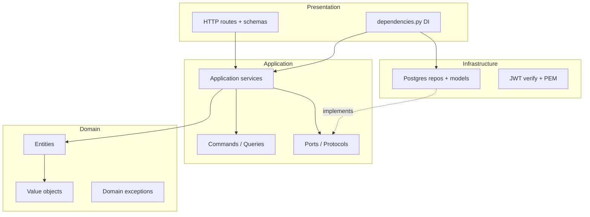
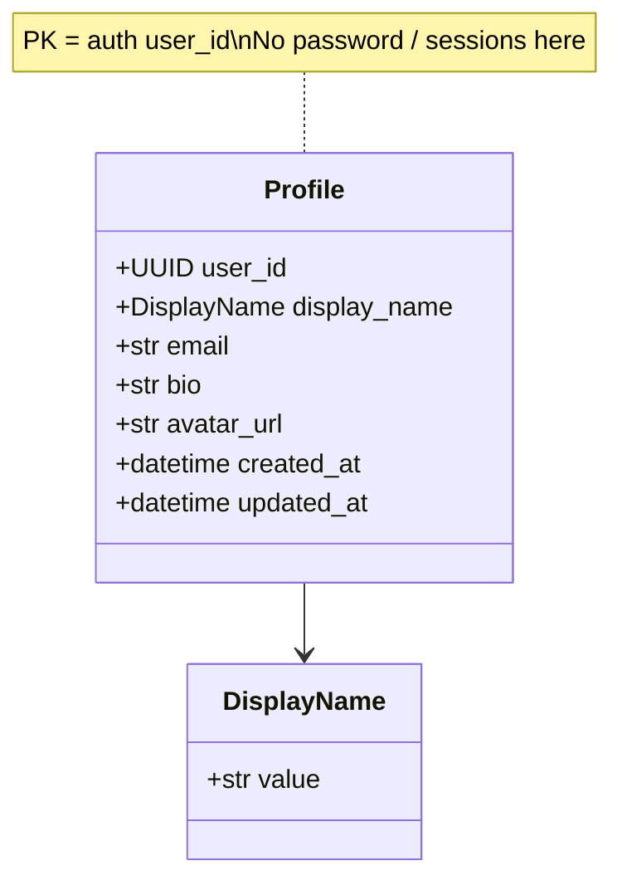
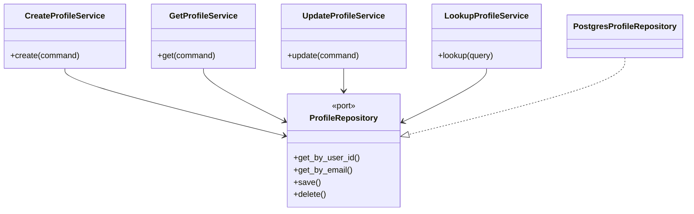
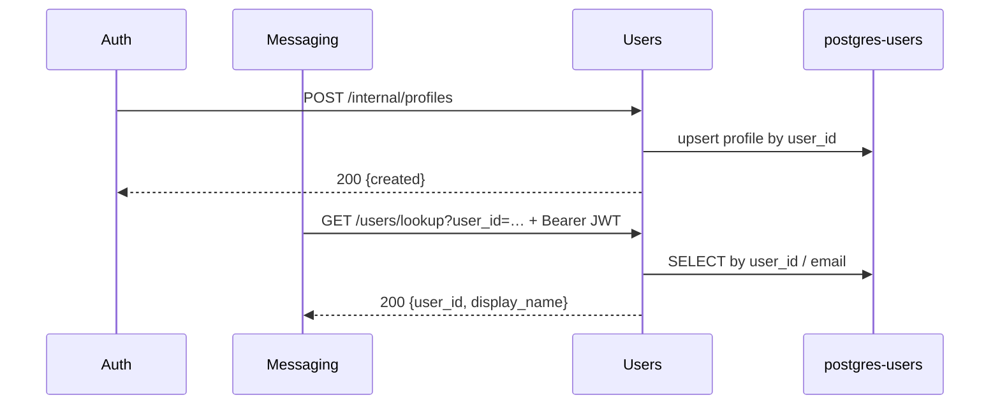

# Users service — UML diagrams

Mermaid diagrams for `app/users/`. Render in GitHub, VS Code Mermaid preview, or [mermaid.live](https://mermaid.live).

## Clean Architecture layers



## Domain class diagram



## Ports and adapters



## Sequence — inbound callers



## HTTP surface

| Method | Path | Notes |
|---|---|---|
| GET | `/health` | Public |
| POST | `/internal/profiles` | Auth → users (Compose-only) |
| GET | `/users/me` | JWT via gateway |
| PATCH | `/users/me` | JWT via gateway |
| GET | `/users/lookup` | JWT; used by messaging |
| GET | `/users/{user_id}` | JWT via gateway |

## Cross-service

```text
auth ──POST /internal/profiles──► users
messaging ──GET /users/lookup (+ JWT)──► users
```

Users does **not** call auth or messaging.
