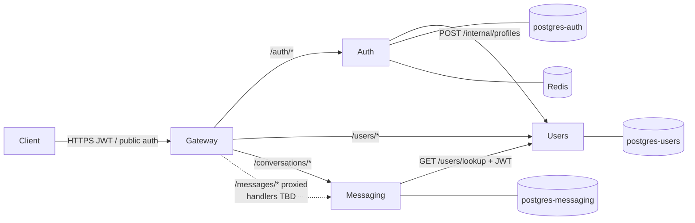

# System context — auth, users, messaging

Cross-service Mermaid view. Service-local UML lives under:

- [`app/auth/docs/uml.md`](../../app/auth/docs/uml.md)
- [`app/users/docs/uml.md`](../../app/users/docs/uml.md)
- [`app/messaging/docs/uml.md`](../../app/messaging/docs/uml.md)

## Component overview



## Call graph

```text
Client
  └─ HTTP → gateway (JWT edge + proxy)
       ├─ /auth/*            → auth
       ├─ /users/*           → users
       ├─ /conversations/*   → messaging
       └─ /messages/*        → messaging (proxied; handlers TBD)

auth  ──POST /internal/profiles──► users
messaging ──GET /users/lookup (+ JWT)──► users
```

No auth↔messaging calls. Users never initiates outbound service calls.
